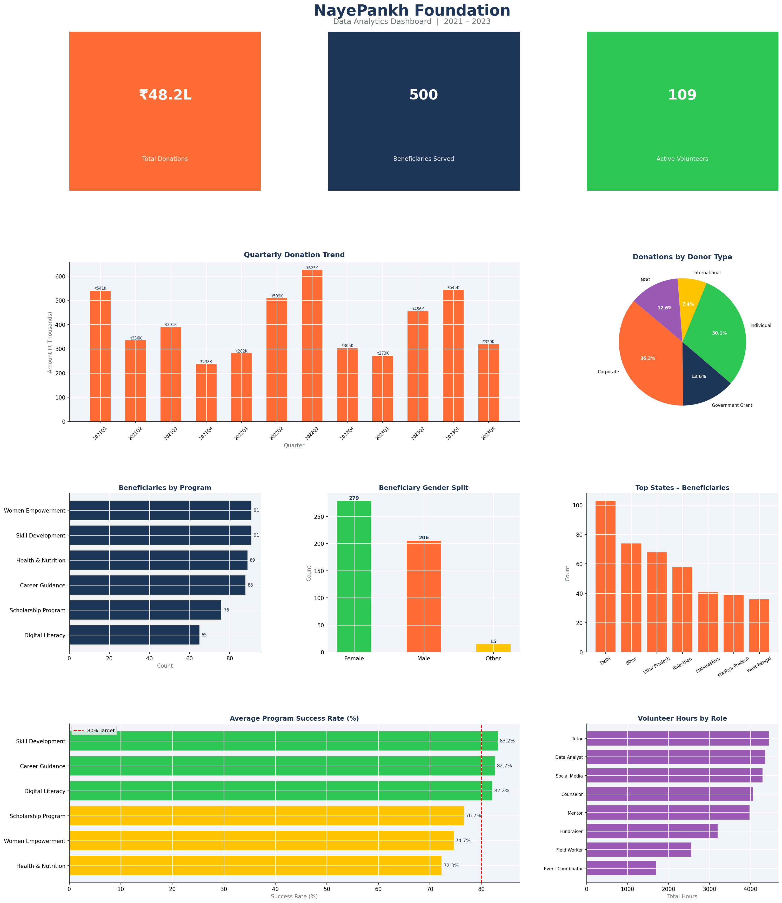
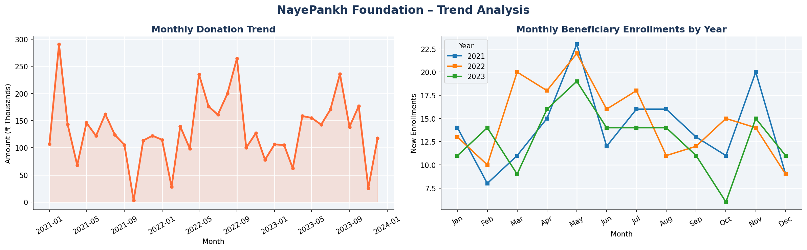

# 📊 NayePankh Foundation – Data Analytics Project

<p align="center">
  
</p>

<p align="center">
  
  
  
  
</p>

---

## 🏢 About NayePankh Foundation

**NayePankh Foundation** is an NGO dedicated to empowering underprivileged youth across India through education, skill development, digital literacy, and career guidance. This project analyzes the foundation's impact, donation trends, volunteer contributions, and program effectiveness using data analytics.

---

## 🎯 Project Objectives

- Analyze beneficiary enrollment trends across states and programs
- Track donation patterns and identify top donor categories
- Measure volunteer contribution and engagement
- Evaluate program success rates and budget utilization
- Build visual dashboards for data-driven decision making

---

## 📁 Project Structure

```
Data-Analytics/
│
├── 📂 data/
│   ├── beneficiaries.csv       # 500 student/beneficiary records
│   ├── donations.csv           # 300 donation transactions (2021–2023)
│   ├── volunteers.csv          # 150 volunteer profiles
│   └── programs.csv            # 72 program-quarter performance records
│
├── 📂 scripts/
│   └── analysis.py             # Full analytics & visualization script
│
├── 📂 outputs/
│   ├── nayepankh_dashboard.png # Main analytics dashboard (7 charts)
│   └── trend_analysis.png      # Donation & enrollment trend charts
│
└── README.md
```

---

## 📈 Key Insights & Findings

| Metric | Value |
|--------|-------|
| 👥 Total Beneficiaries Served | 500 |
| 💰 Total Donations Raised | ₹48.2 Lakh |
| 🙋 Active Volunteers | 109 |
| 🎓 Total Scholarships Awarded | ₹15.4 Lakh |
| 🏆 Avg Program Success Rate | 78.6% |
| 📍 Highest Enrolled State | Delhi |
| 🌟 Top Performing Program | Skill Development |
| 📅 Data Period | 2021 – 2023 |

---

## 📊 Dashboard Preview

### Main Analytics Dashboard


### Trend Analysis


---

## 🗃️ Dataset Description

### `beneficiaries.csv`
Records of students and beneficiaries enrolled in foundation programs.

| Column | Description |
|--------|-------------|
| beneficiary_id | Unique ID |
| name | Beneficiary name |
| age | Age of beneficiary |
| gender | Male / Female / Other |
| state | State of residence |
| program | Enrolled program |
| education_level | Education level |
| enrollment_date | Date of enrollment |
| scholarship_amount | Scholarship awarded (₹) |
| status | Active / Completed / Dropped |

### `donations.csv`
Donation transactions from individual, corporate, and other donors.

| Column | Description |
|--------|-------------|
| donation_id | Unique ID |
| donor_type | Individual / Corporate / NGO / Govt / International |
| amount | Donation amount (₹) |
| donation_date | Date of donation |
| mode | Payment mode |
| purpose | Program/purpose of donation |
| state | Donor state |

### `volunteers.csv`
Volunteer profiles and their contributions.

| Column | Description |
|--------|-------------|
| volunteer_id | Unique ID |
| name | Volunteer name |
| role | Role (Mentor, Tutor, etc.) |
| hours_contributed | Total hours volunteered |
| status | Active / Inactive |

### `programs.csv`
Quarterly performance data for each program.

| Column | Description |
|--------|-------------|
| program_name | Program name |
| year | Year |
| quarter | Quarter (Q1–Q4) |
| beneficiaries_reached | Number of beneficiaries |
| budget_allocated | Budget allocated (₹) |
| budget_spent | Budget utilized (₹) |
| success_rate | Program success rate (0–1) |

---

## 🛠️ Tech Stack

| Tool | Purpose |
|------|---------|
| **Python 3.x** | Core programming language |
| **Pandas** | Data manipulation & analysis |
| **Matplotlib** | Data visualization |
| **Seaborn** | Statistical charts |
| **Tableau** | Interactive dashboards |
| **Git & GitHub** | Version control |

---

## 🚀 How to Run

### 1. Clone the Repository
```bash
git clone https://github.com/Nimit-Jain2501/Data-Analytics.git
cd Data-Analytics
```

### 2. Install Dependencies
```bash
pip install pandas numpy matplotlib seaborn openpyxl
```

### 3. Run Full Analysis
```bash
python scripts/analysis.py
```

Charts will be saved in the `outputs/` folder automatically.

---

## 👤 Author

**Nimit Jain**
Data Analytics Intern @ NayePankh Foundation
🔗 [GitHub Profile](https://github.com/Nimit-Jain2501)

---

## 🤝 Acknowledgements

Special thanks to **NayePankh Foundation** for the opportunity to work on this meaningful project aimed at empowering underprivileged youth across India.

---

<p align="center">Made with ❤️ for NayePankh Foundation Internship</p>
